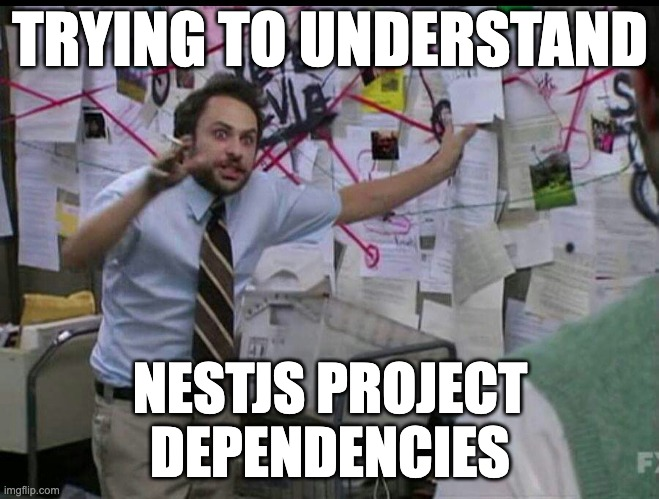
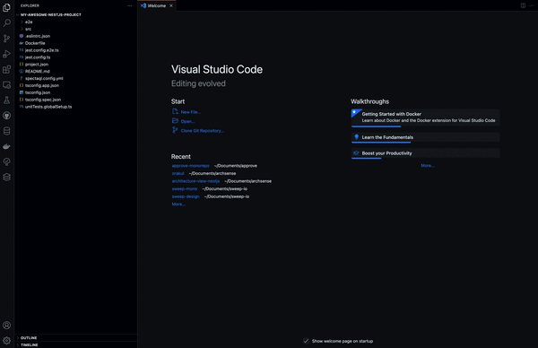

# Architecture View for NestJs

Visualize the architecture of your NestJs application.

<p align="center">
  <a href="https://marketplace.visualstudio.com/items?itemName=archsense.architecture-view-nestjs">
    
  </a>
  <a href="https://marketplace.visualstudio.com/items?itemName=archsense.architecture-view-nestjs">
    
  </a>
  <br />
  <a href="https://ko-fi.com/archsense" target="_blank">
    
  </a>
</p>
<br>



## Usage



Inside the opened NestJs application in your workspace, run the following command from the pallette:

```
> Show architecture
```

## Credits

- [Architecture icons created by Freepik - Flaticon](https://www.flaticon.com/free-icons/architecture)

## License

[MIT](/LICENSE)
